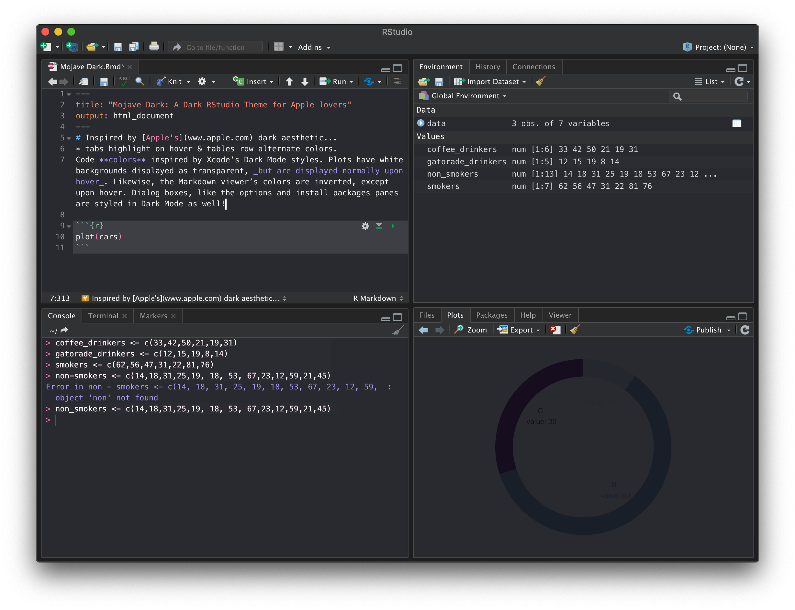
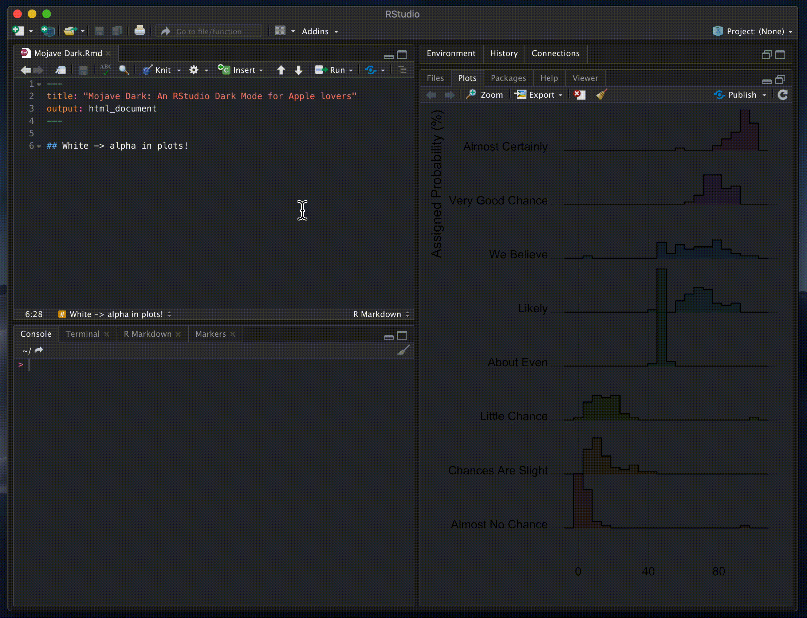
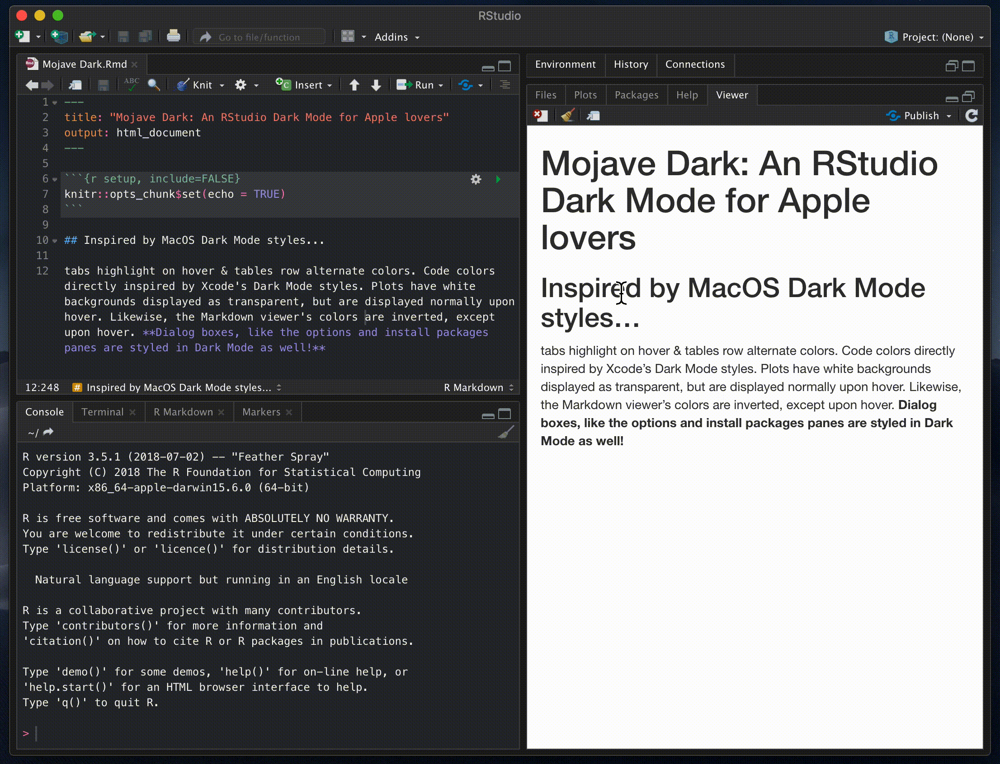
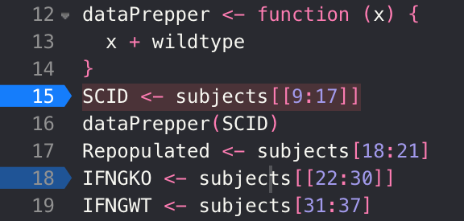
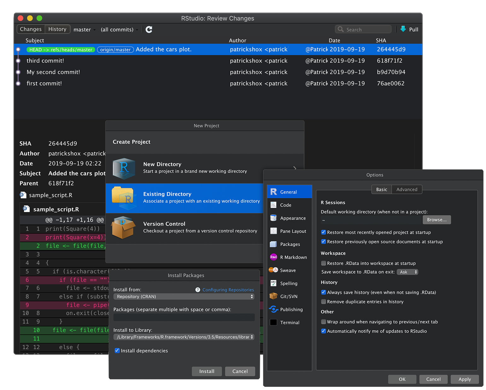

# Mojave Dark: An RStudio Theme for Apple Lovers



### Dynamic darkening of plots and markdown:

Plot (white to alpha)             |  Markdown (invert colors)
:-------------------------:|:-------------------------:
  |  

### An Xcode-inspired debugger:


### Dark styles across the entire IDE, not just the editor:


### Code coloring inspired by Xcode:

Mojave Dark              |  Xcode
:-------------------------:|:-------------------------:
   |   

## Installation Options
### Via the RStudio Console (Reccomended):
In RStudio Preferences > Appearance, **set the theme to Modern or Sky**. Currently, Mojave Dark doesn't work when the RStudio theme is set to Classic. Then, run the snippet in the RStudio console to install and apply Mojave Dark.
```
rstudioapi::addTheme("https://raw.githubusercontent.com/patrickshox/Mojave-Dark-RStudio-Theme/master/Mojave%20Dark.rstheme", apply=TRUE, force=TRUE)
```
The parameter `force=TRUE` will delete any other themes named "Mojave Dark" and the parameter `globally=TRUE` will install the theme for all users.

### Manually:
First, download the [.rstheme file](https://drive.google.com/open?id=18A_Tb0vq4T_gmFtcvGoXzIlaMoUJNmvJ) via Google Drive. Navigate to RStudio options (&#8984; ,), then select the "Appearance" tab in the sidebar. Press the "Add..." button to manually install the .rstheme file. Finally, apply the theme as you would any other.

## Troubleshooting
- `Error in value[[3L]](cond): Unable to add the theme file "/var/folders/tj/w1l6l2hj11l4kpyhv4r2p6gh0000gn/T//RtmpZTjGp2/Mojave Dark.rstheme". The specified theme, "Mojave Dark", already exists in the target location. Please delete the existing theme and try again.`

Go to the Folder (&#8984; &#8679; G) `~/.R/rstudio/themes` and delete the file "Mojave Dark.rstheme". Then retry installing Mojave Dark.
- `Error in loadNamespace(name) : there is no package called ‘rstudioapi’`

Run `install.packages("rstudioapi")`. Then retry installing Mojave Dark. 

