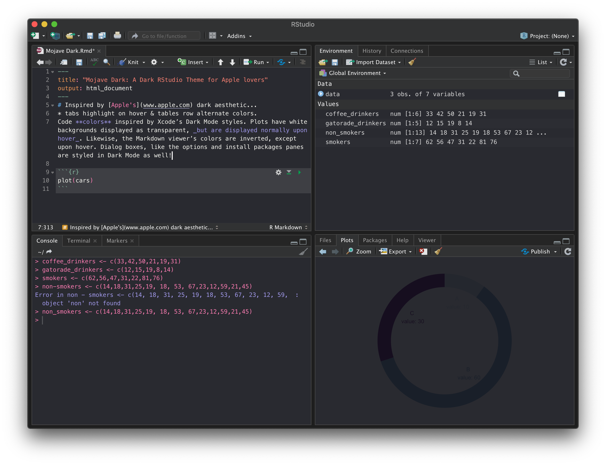
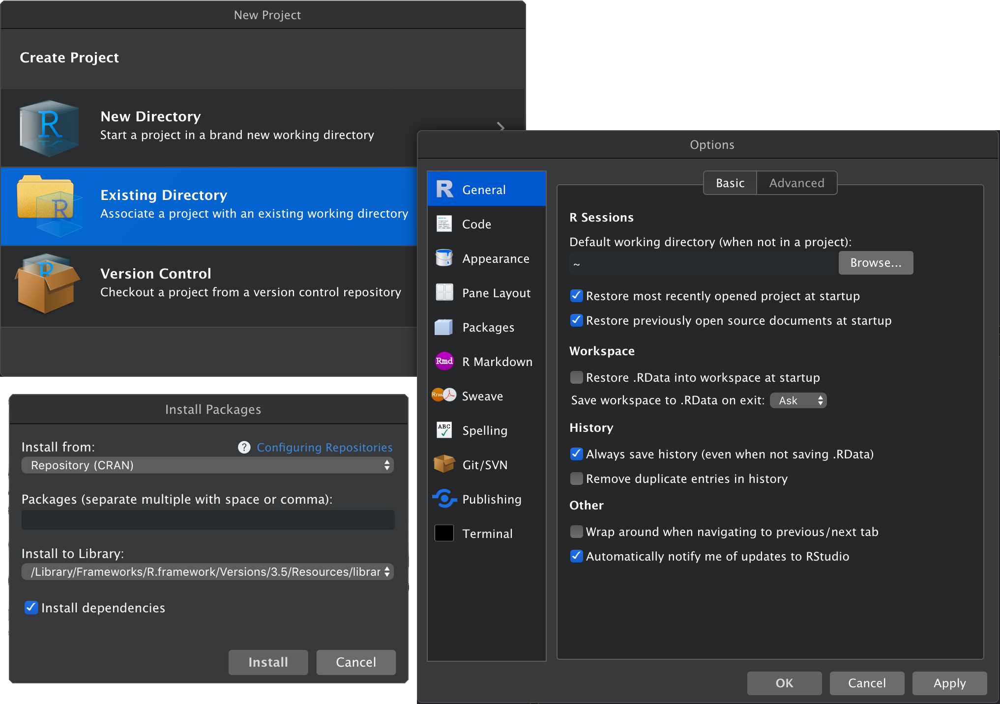

# Mojave Dark: An RStudio Theme for Apple Lovers



### Dynamic darkening of plots and markdown:

Plot             |  Markdown
:-------------------------:|:-------------------------:
  |  

### An Xcode-inspired debugger:


### And Dark styles across the entire IDE, not just the editor:


## Installation
```
rstudioapi::addTheme("https://raw.githubusercontent.com/patrickshox/Mojave-Dark-RStudio-Theme/master/Mojave%20Dark.rstheme", apply=TRUE, force=TRUE, global=TRUE)
```
